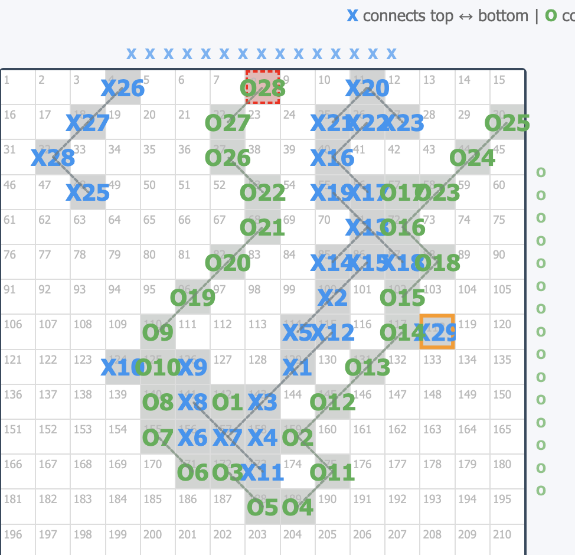
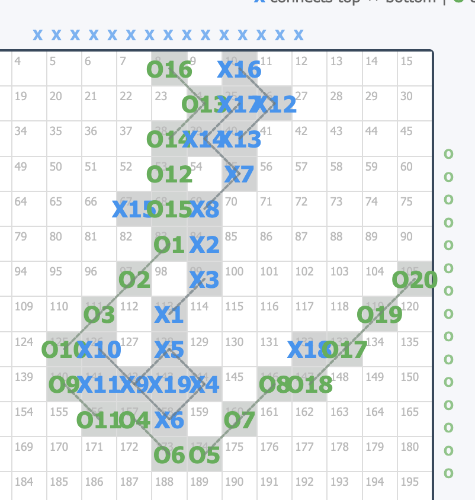

# Fence Detection Algorithm for Line Game

## Overview

In the Fence variant of the Line Game, players can capture opponent pieces by enclosing them with a continuous chain of their own pieces (a "fence"). When a fence is completed, all pieces inside the enclosed area are captured and returned to the players' pools.

## Visual Examples

### Example 1: Large Border-Anchored Fence


- **Fence:** O28 (top border) → O27 → O26 → O22 → O21 → O20 → O19 → O9 → O10 → O8 → O7 → O6 → O5 → O4 → O3 → O11 → O12 → O13 → O14 → O15 → O18 → O16 → O23 → O24 → O25 (right border)
- **Enclosed pieces:** X1-X29 (all X pieces in the gray shaded area)
- **Fence type:** Border-anchored (connects top border to right border)

### Example 2: Simpler Border-Anchored Fence


- **Fence:** O16 (top border) → continuous chain → O20 (right border)
- **Enclosed pieces:** X1-X19 (gray shaded area)
- **Fence type:** Border-anchored (connects top border to right border)

---

## Definitions

### 1. Adjacency
- **8-connected adjacency**: A cell is adjacent to its 8 neighbors (orthogonal + diagonal)
- Same adjacency rules as the win condition in Span
- Diagonal connections CAN be blocked by crossing opponent diagonals (established earlier)

### 2. Types of Fences

#### Type A: Circular Fence (No Border Contact)
- A chain of same-player pieces that forms a complete loop
- The chain starts at any cell and returns to the same cell through sequential adjacency
- No borders are involved in forming the enclosure
- The fence itself forms the entire boundary of the enclosed region

#### Type B: Border-Anchored Fence
- A chain of same-player pieces connecting to two or more border points
- The chain + the border segment between the anchor points forms the enclosure
- The "inside" is determined by which region is smaller
- The border segment that is part of the enclosure is the SMALLER arc between anchor points

### 3. Enclosed Region
A cell (or piece) is **inside** a fence if:
- It cannot reach the "free" portion of the board border without crossing the fence
- For border-anchored fences: the "free" border is the LARGER arc between anchor points
- For circular fences: the entire board border is "free"

### 4. Capture Rules
When a fence is completed:
1. All **opponent pieces** inside the fence are captured
2. All **own pieces** inside the fence are also captured (returned to pool)
3. The **fence pieces themselves** are removed after capture
4. All captured pieces return to their respective player's pools

---

## Algorithm Design

### Phase 1: Detect Fence Completion

```
function detectFenceCompletion(board, lastMove):
    player = lastMove.player
    component = getConnectedComponent(lastMove.position, player)

    // Check Type A: Circular fence
    if hasCycle(component):
        return {type: 'circular', fence: component}

    // Check Type B: Border-anchored fence
    borderTouches = getBorderTouchPoints(component)
    if borderTouches.length >= 2:
        if areNonAdjacent(borderTouches):
            return {type: 'border-anchored', fence: component, anchors: borderTouches}

    return null  // No fence completed
```

### Phase 2: Find Connected Component (8-adjacency)

```
function getConnectedComponent(startPos, player):
    component = new Set()
    queue = [startPos]

    while queue is not empty:
        pos = queue.pop()
        if pos in component:
            continue
        if board[pos] != player:
            continue

        component.add(pos)

        for neighbor in get8Neighbors(pos):
            if isValidPosition(neighbor) and board[neighbor] == player:
                // Check diagonal blocking rule
                if isDiagonalMove(pos, neighbor):
                    if isDiagonalBlocked(pos, neighbor):
                        continue  // Skip blocked diagonal
                queue.push(neighbor)

    return component
```

### Phase 3: Detect Cycle in Component

```
function hasCycle(component):
    if component.size < 4:
        return false  // Need at least 4 pieces for a cycle

    // Use DFS to detect back-edge (cycle)
    visited = new Set()
    parent = new Map()

    startNode = component.first()

    function dfs(node, parentNode):
        visited.add(node)
        parent.set(node, parentNode)

        for neighbor in get8Neighbors(node):
            if neighbor not in component:
                continue
            if isDiagonalBlocked(node, neighbor):
                continue

            if neighbor not in visited:
                if dfs(neighbor, node):
                    return true
            else if neighbor != parentNode:
                // Found a back-edge = cycle exists
                return true

        return false

    return dfs(startNode, null)
```

### Phase 4: Get Border Touch Points

```
function getBorderTouchPoints(component):
    touchPoints = []
    boardSize = getBoardSize()

    for pos in component:
        if pos.row == 0:                    // Top border
            touchPoints.push({pos, border: 'top'})
        if pos.row == boardSize - 1:        // Bottom border
            touchPoints.push({pos, border: 'bottom'})
        if pos.col == 0:                    // Left border
            touchPoints.push({pos, border: 'left'})
        if pos.col == boardSize - 1:        // Right border
            touchPoints.push({pos, border: 'right'})

    return touchPoints
```

### Phase 5: Determine Enclosed Region (Flood Fill)

```
function findEnclosedCells(board, fence, fenceType, anchors):
    // Step 1: Identify "free" border cells
    freeBorderCells = getFreeBorderCells(fence, fenceType, anchors)

    // Step 2: Flood fill from free border (8-connected)
    outside = new Set()
    queue = [...freeBorderCells]

    while queue is not empty:
        pos = queue.pop()
        if pos in outside:
            continue
        if pos in fence:
            continue  // Cannot cross fence

        outside.add(pos)

        for neighbor in get8Neighbors(pos):
            if isValidPosition(neighbor) and neighbor not in fence:
                queue.push(neighbor)

    // Step 3: Everything not outside and not fence is inside
    inside = new Set()
    for each cell on board:
        if cell not in outside and cell not in fence:
            inside.add(cell)

    return inside
```

### Phase 6: Get Free Border Cells

```
function getFreeBorderCells(fence, fenceType, anchors):
    if fenceType == 'circular':
        // For circular fences, entire border is free
        return getAllBorderCells()

    // For border-anchored fences:
    // Find the LARGER arc between anchor points (that's the free border)

    anchor1 = anchors[0].pos
    anchor2 = anchors[1].pos

    // Walk border in both directions
    arc1 = walkBorderClockwise(anchor1, anchor2)
    arc2 = walkBorderCounterclockwise(anchor1, anchor2)

    // The LARGER arc is the free border
    // The SMALLER arc is part of the enclosure
    if arc1.length > arc2.length:
        return arc1
    else:
        return arc2
```

### Phase 7: Execute Capture

```
function executeCapture(board, fence, insideCells):
    capturedPieces = []

    // Capture all pieces inside the fence
    for cell in insideCells:
        if board[cell] != empty:
            capturedPieces.push({
                player: board[cell],
                position: cell,
                type: 'enclosed'
            })
            board[cell] = empty

    // Remove fence pieces (they dissolve after capturing)
    for cell in fence:
        capturedPieces.push({
            player: board[cell],
            position: cell,
            type: 'fence'
        })
        board[cell] = empty

    // Return pieces to pools
    returnToPool(capturedPieces)

    return capturedPieces
```

---

## Architecture

### File Structure

```
line_game/
├── Fence/
│   ├── FENCE-DETECTION.md      # This documentation
│   ├── fence-example-1.png     # Visual example 1
│   ├── fence-example-2.png     # Visual example 2
│   └── fence-tests/            # Test cases (future)
│
├── js/
│   ├── fence-detector.js       # Main fence detection module
│   ├── fence-region-finder.js  # Flood fill & region detection
│   ├── fence-capture.js        # Capture execution logic
│   └── fence-visualizer.js     # UI for showing fences & captures
│
└── css/
    └── fence-styles.css        # Styles for fence visualization
```

### Module Responsibilities

#### 1. `fence-detector.js`
- Main entry point for fence detection
- Called after each move to check for completed fences
- Exports: `FenceDetector` class
- Methods:
  - `detectFence(lastMove)` - Check if move completes a fence
  - `getConnectedComponent(pos, player)` - Get all connected pieces
  - `hasCycle(component)` - Detect circular fence
  - `getBorderAnchors(component)` - Find border touch points

#### 2. `fence-region-finder.js`
- Determines which cells are inside/outside a fence
- Handles both circular and border-anchored fences
- Exports: `FenceRegionFinder` class
- Methods:
  - `findEnclosedRegion(fence, anchors)` - Main region finder
  - `getFreeBorderCells(anchors)` - Determine free border
  - `floodFillOutside(freeBorder, fence)` - Mark outside cells

#### 3. `fence-capture.js`
- Executes capture logic when fence is detected
- Handles piece removal and pool management
- Exports: `FenceCapture` class
- Methods:
  - `executeCapture(fence, enclosedCells)` - Main capture
  - `returnToPool(pieces)` - Return captured pieces to pools
  - `getCaptureStats()` - Statistics for UI

#### 4. `fence-visualizer.js`
- Visual feedback for fences and captures
- Highlights enclosed regions
- Animation for capture sequence
- Exports: `FenceVisualizer` class
- Methods:
  - `highlightFence(fenceCells)` - Show fence chain
  - `highlightEnclosed(cells)` - Show enclosed region
  - `animateCapture(captures)` - Capture animation

### Integration with Game Core

```javascript
// In game-core.js or main controller

class GameCore {
    constructor() {
        this.fenceDetector = new FenceDetector(this);
        this.fenceCapture = new FenceCapture(this);
        this.fenceVisualizer = new FenceVisualizer(this);
    }

    makeMove(row, col, player) {
        // ... existing move logic ...

        const result = this.board[row][col] = player;

        // Check for fence completion
        const fence = this.fenceDetector.detectFence({row, col, player});

        if (fence) {
            const enclosed = this.fenceDetector.findEnclosedRegion(fence);
            const captures = this.fenceCapture.executeCapture(fence, enclosed);
            this.fenceVisualizer.animateCapture(captures);

            return {
                success: true,
                fenceCompleted: true,
                captures: captures
            };
        }

        return { success: true, fenceCompleted: false };
    }
}
```

---

## Implementation Plan

### Phase 1: Core Detection (Priority: High)
1. Implement `getConnectedComponent()` with 8-adjacency
2. Implement diagonal blocking check integration
3. Implement `hasCycle()` for circular fences
4. Implement `getBorderAnchors()` for border-anchored fences
5. Unit tests for detection logic

### Phase 2: Region Finding (Priority: High)
1. Implement `getFreeBorderCells()` with arc calculation
2. Implement flood fill algorithm
3. Implement `findEnclosedRegion()`
4. Unit tests for region finding

### Phase 3: Capture Execution (Priority: Medium)
1. Implement piece removal logic
2. Implement pool management
3. Integrate with game state
4. Unit tests for capture

### Phase 4: Visualization (Priority: Medium)
1. Implement fence highlighting
2. Implement enclosed region shading
3. Implement capture animation
4. CSS styles for visual feedback

### Phase 5: Integration & Testing (Priority: High)
1. Integrate with main game controller
2. End-to-end testing with real game scenarios
3. Performance optimization
4. Edge case handling

---

## Edge Cases to Handle

1. **Multiple fences at once**: A single move might complete multiple fences
2. **Nested fences**: A fence inside another fence
3. **Fence touches same border twice**: Valid if points are non-adjacent
4. **Diagonal blocking**: Respect existing diagonal crossing rules
5. **Empty enclosed region**: Fence with no pieces inside (still valid)
6. **Self-enclosure**: Player's own pieces inside (captured too)
7. **Very small fences**: Minimum 3-4 pieces for a valid fence

---

## Testing Strategy

### Unit Tests
- Connected component finding
- Cycle detection
- Border anchor identification
- Region flood fill
- Capture execution

### Integration Tests
- Full game scenarios from screenshots
- Edge cases listed above
- Performance with large boards

### Visual Tests
- Fence highlighting accuracy
- Enclosed region shading
- Capture animation smoothness
